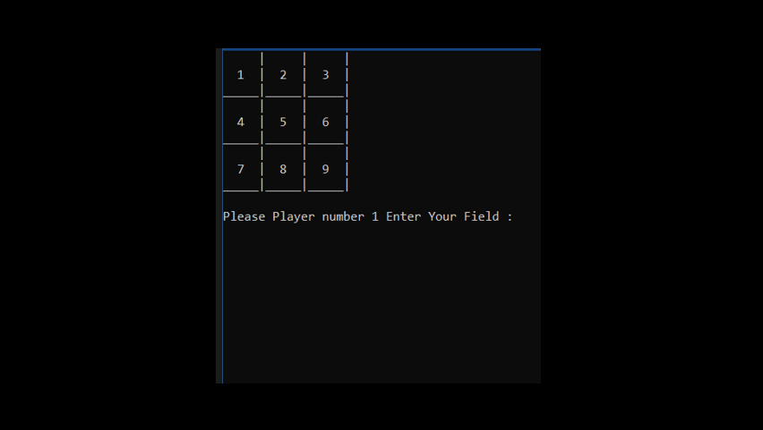
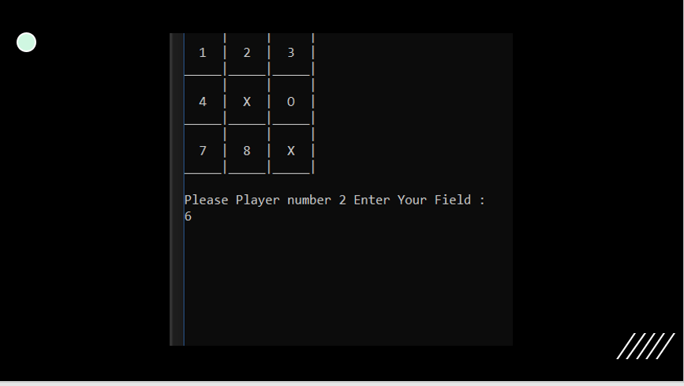
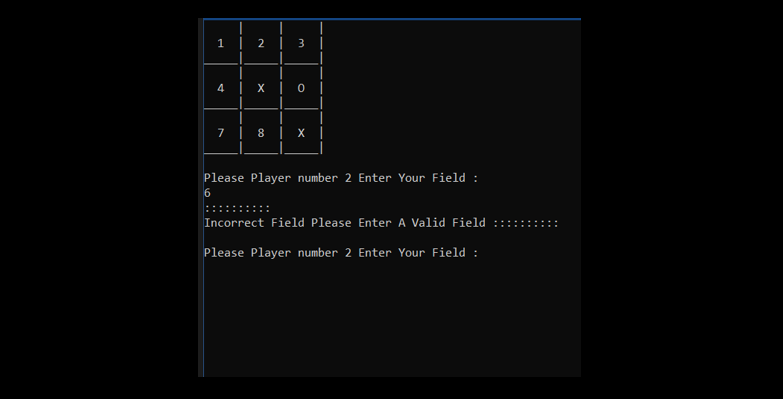
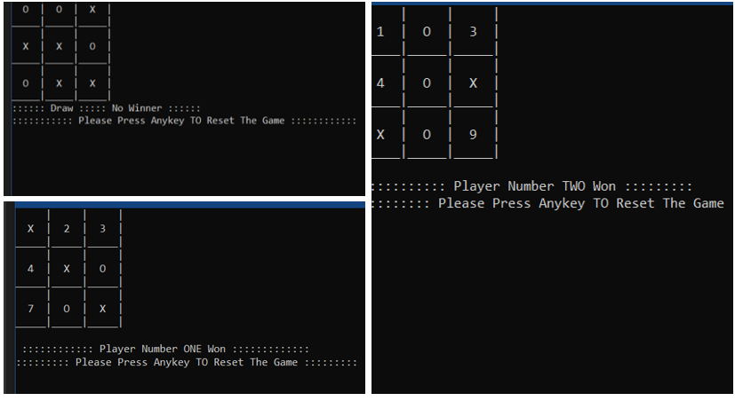
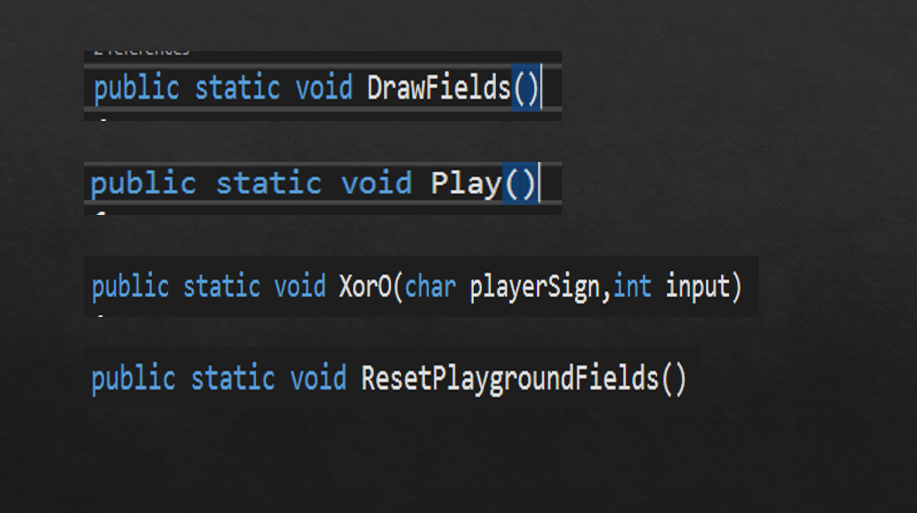

# Tic-Tac-Toe-Console-Game

Tic-Tac-Toe is a very simple two player game. So only two players can play at a time. This game is also known as Xs and Os game. the first player plays with X and the second player plays with O. In this game I used C# console app.

## Getting Started

Go ahead and download the zip file then open the .sln file. You will have the full project click run and you should see this screen : 

    

 Enter a field number and it will automatically replace the field number with the player sign X or O as you see in this screen:

    

 If one of the players enters an existing field number a message will display to make the players choose another field. 

    

After all fields assigned to player signs Xs and Os you will have one of the three results : 

    

<ol>
  <li>Player ONE Won</li>
  <li>Player TWO Won</li>
  <li>Draw No Winners</li>
</ol> 

After one of those results you can press anykey to reset the game and play again.

## Prerequisites

Visual Studio 2017 or higher. 

## Installing

Find the Visual Studio versions in this link : 
<a href="https://visualstudio.microsoft.com/downloads/" target="_blank">Visual Studio Download</a>

## Code

In this project I used: 
 <ol>
  <li>Multidimensional array (2D array).</li>
  <li>Methods.</li>
  <li>Loops.</li>
  <li>conditions. (if condition & switch case)</li>
  <li>Exception Handling.</li>
</ol> 

   It consists of four methods:
     

    

<ol>
  <li>DrawFields() :  this method is responsible for drawing a 2d array that contains the set of fields to shape the playground Fields.</li>
  <li>Play() :  this method is responsible for the game rules and the play techniques. </li>
  <li>XorO(char playerSign,int input) :  his method takes two parameters and check which field the player has choosen to replace it with the player sign (X or O).</li>
  <li>ResetPlaygroundFields() :  this method is responsible for resetting the 2d array to it's first shape and re-draw the fields on the console.</li>
</ol> 

##Note

I will gladly acccept any comments or updates to the code just if you have any better ideas or found a bug that I missed let me know and assign  me a pull request. 
