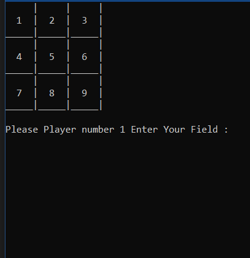
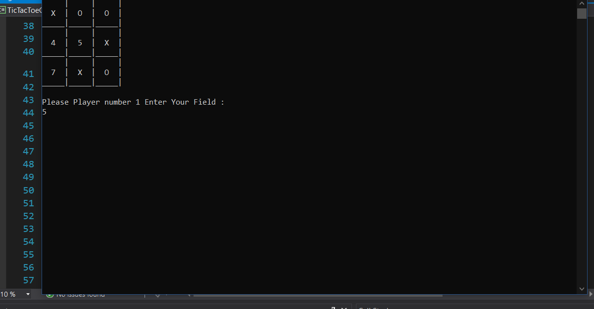
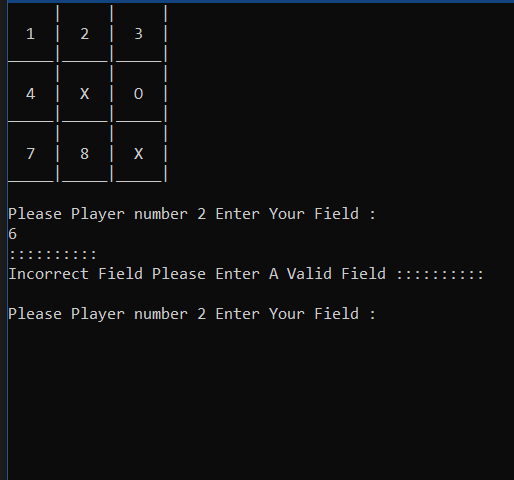
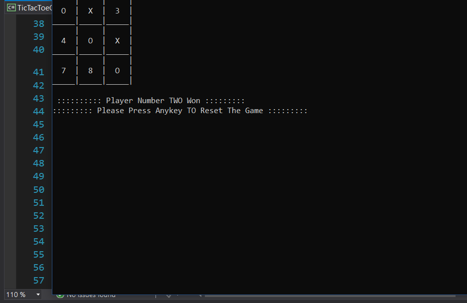
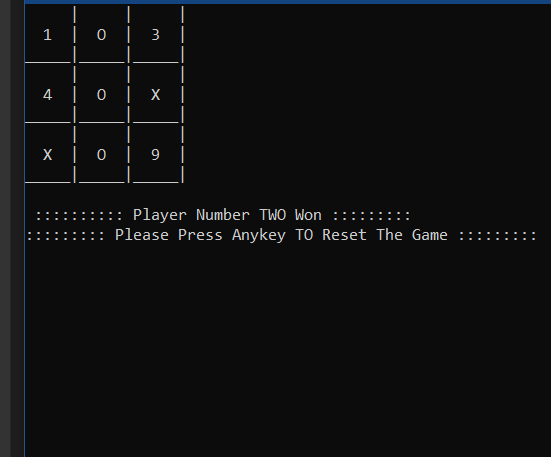

# Tic-Tac-Toe-Console-Game

Tic-Tac-Toe is a very simple two player game. So only two players can play at a time. This game is also known as Xs and Os game. the first player plays with X and the second player plays with O. In this game I used C# console app.

## Getting Started

Go ahead and download the zip file then decompress it and open the .sln file. You will have the full project click run and you should see this screen : 

    

Then after you choose a field will automatically replace the field number with the player sign X or O as you see in this screen :

    

After playing you will have one of the  three results : 

1. Player ONE Won.

2. Player TWO Won.

3. Draw No Winners. 

Result 1 : 

    

Result 2 : 

    

Result 3 : 

    

### Prerequisites

Visual Studio 2017 or higher. 

### Installing

Find the Visual Studio versions in this link : 
<a href="https://visualstudio.microsoft.com/downloads/">Visual Studio Download</a>

